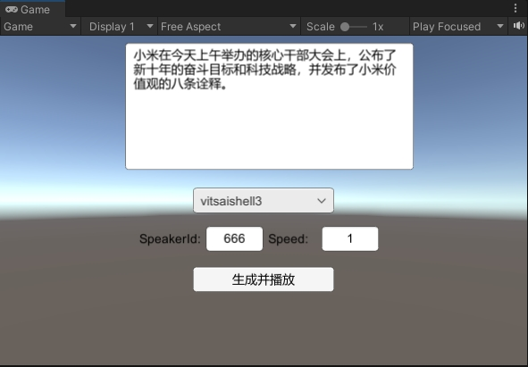
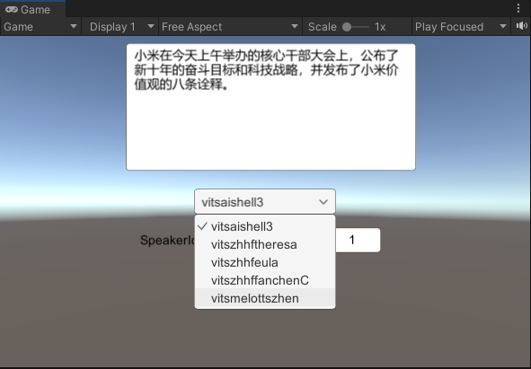
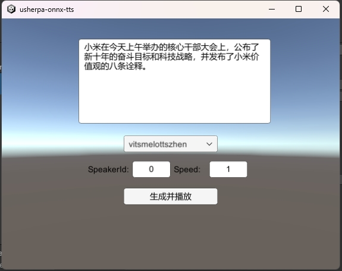

# usherpa-onnx-tts-unityandroid

#### 介绍
Unity使用sherpa-onnx实现离线语音合成,编译到安卓手机

#### 使用说明
unity版本：2021.3.45f1c1
1.  下载模型解压放置到StreamingAssets下
2.	模型下载地址https://k2-fsa.github.io/sherpa/onnx/tts/pretrained_models/index.html
3.	测试的模型是  
    vits-zh-hf-theresa    
目录结构如图    

